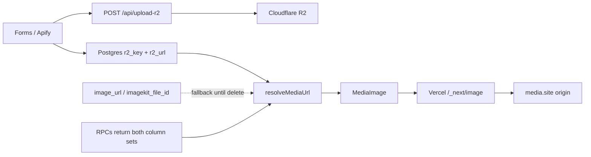

# ImageKit → Cloudflare R2 migration runbook

Source of truth for finishing **aesthetic-clinics-my** and replicating on **dental-clinics-close-to-me**.

## Goals (both projects)

- **Non-breaking DB:** keep ImageKit/legacy columns; add `r2_key` + `r2_url`.
- New uploads write **only** R2 columns (do not write `image_url` / `imagekit_file_id` for new rows).
- Serving: `resolveMediaUrl` prefers `r2_url`, then falls back to ImageKit/legacy URLs.
- **Storage:** Cloudflare R2 + custom domain `media.<site>`.
- **Resizing:** Next.js / **Vercel Image Optimization** (`next/image`). **Do not** use Cloudflare `/cdn-cgi/image` (tried; unique-transform pricing was too expensive for listing traffic).
- Image sizes: shared presets in [`lib/media-sizes.ts`](lib/media-sizes.ts); keep `next.config.ts` `deviceSizes` / `imageSizes` in sync.
- RPCs return **both** ImageKit and R2 fields so old and new app code keep working.
- Delete ImageKit files **last**, after verify (dry-run default).
- Editor / Vercel Blob uploads stay out of scope.

## Safe deploy order

```text
1. Schema SQL (r2 columns)          ← additive; safe alone
2. RPC SQL (dual ImageKit + R2)     ← additive JSON keys; safe alone (no app deploy needed)
3. App code (R2 APIs, MediaImage, callers, resolveMediaUrl fallback, media-sizes)
4. Backfill ImageKit → R2           ← fills r2_*; never clears ImageKit cols
5. Verify listings + dashboard uploads
6. Upload static logo/ads to R2; point absolute URLs
7. Delete ImageKit assets (dry-run → execute)
8. Remove legacy ImageKit API routes + env + remotePatterns
```

**Important:** Applying RPC migrations **without** code changes does **not** break the live site — they only add `r2_url` / `r2_key` while keeping `image_url` / `imagekit_file_id`. What *would* break images is deploying R2-only serving **without** fallback before backfill completes.

## Project mapping

| | aesthetic-clinics-my | dental-clinics-close-to-me |
|--|--|--|
| Site | https://aestheticclinics.my | (dental production domain) |
| Media CDN (R2) | `https://media.aestheticclinics.my` | e.g. `https://media.<dental-domain>` |
| R2 bucket | `aesthetic-clinic-media-production` | new bucket (e.g. `dental-clinic-media-production`) |
| Image resize | Vercel `next/image` → `/_next/image?url=…` | same |
| ImageKit id (legacy) | `yuurrific` | check that project's `NEXT_PUBLIC_IMAGEKIT_ID` |
| Status | Verified; next: static assets → delete ImageKit → cleanup | Not started — follow this runbook |

Keep aesthetic and dental R2 buckets **separate**.

---

## Ordered checklist (replicate in this order)

### 0. Cloudflare R2 (manual)

1. Create R2 bucket.
2. Attach custom domain `media.<site>` to the bucket (public).
3. Create R2 API token (Object Read & Write).
4. Add to `.env.local` + `.env.sample`:

```bash
R2_ACCOUNT_ID=
R2_ACCESS_KEY_ID=
R2_SECRET_ACCESS_KEY=
R2_BUCKET=<bucket-name>
R2_ENDPOINT=https://<ACCOUNT_ID>.r2.cloudflarestorage.com
NEXT_PUBLIC_R2_PUBLIC_URL=https://media.<site>
```

5. Keep ImageKit env until step 7:

```bash
IMAGEKIT_PRIVATE_KEY=
NEXT_PUBLIC_IMAGEKIT_ID=
```

6. Smoke-test: object reachable at `NEXT_PUBLIC_R2_PUBLIC_URL/<key>`.

**Do not** enable Cloudflare Image Transformations for app serving (Vercel handles resize). R2 is storage + CDN origin only.

**aesthetic:** done (`R2_BUCKET=aesthetic-clinic-media-production`, public URL `https://media.aestheticclinics.my`).

### 1. Schema (manual SQL)

Apply in Supabase SQL editor (do not auto-apply via MCP on production):

[`supabase/migrations/20260904000000_add_r2_media_columns.sql`](supabase/migrations/20260904000000_add_r2_media_columns.sql)

```sql
ALTER TABLE clinic_images
  ADD COLUMN IF NOT EXISTS r2_key text,
  ADD COLUMN IF NOT EXISTS r2_url text;

ALTER TABLE clinic_doctor_images
  ADD COLUMN IF NOT EXISTS r2_key text,
  ADD COLUMN IF NOT EXISTS r2_url text;

ALTER TABLE areas
  ADD COLUMN IF NOT EXISTS r2_key text,
  ADD COLUMN IF NOT EXISTS r2_url text;

ALTER TABLE states
  ADD COLUMN IF NOT EXISTS r2_key text,
  ADD COLUMN IF NOT EXISTS r2_url text;

-- Allow R2-only inserts (ImageKit columns retained but unused for new uploads)
ALTER TABLE clinic_images
  ALTER COLUMN image_url DROP NOT NULL,
  ALTER COLUMN imagekit_file_id DROP NOT NULL;

ALTER TABLE clinic_doctor_images
  ALTER COLUMN image_url DROP NOT NULL,
  ALTER COLUMN imagekit_file_id DROP NOT NULL;
```

Then update `types/database.types.ts` + app types (`types/clinic.ts`) for `r2_key` / `r2_url` and nullable ImageKit fields.

**Note:** live `clinics` / `clinic_doctors` tables have **no** `images` column (images live in child tables). Do not insert `images: null` into those parent tables (causes `PGRST204`).

**aesthetic:** done.

### 2. RPC dual-column migrations (manual SQL)

Apply **after** schema columns exist. Both files keep ImageKit fields and add R2 fields.

| File | Functions |
|------|-----------|
| [`supabase/migrations/20260904120000_get_clinic_by_slug_r2_only.sql`](supabase/migrations/20260904120000_get_clinic_by_slug_r2_only.sql) | `get_clinic_by_slug` |
| [`supabase/migrations/20260904130000_rpc_images_r2_only.sql`](supabase/migrations/20260904130000_rpc_images_r2_only.sql) | `get_doctors_by_clinic_slug`, `get_nearby_clinics`, `get_ranged_area_metadata_by_slug`, `get_ranged_doctor_by_state_slug`, `get_ranged_state_metadata_by_slug` |

**Image object shape (clinic / doctor images):**

```json
{
  "id": "...",
  "image_url": "...",
  "imagekit_file_id": "...",
  "r2_url": "...",
  "r2_key": "...",
  "display_order": 0
}
```

**Area / state rows:** prefer `to_jsonb(row)` (or explicit legacy fields + `r2_*`) so nested metadata keeps `image`, `thumbnail_image`, `banner_image`, `imagekit_file_id`, etc.

**Notes for dental:**

1. Dump live RPC defs first (`pg_get_functiondef`) — dental may differ slightly; port the **image payload** pattern, don't blindly overwrite unrelated logic.
2. If dental has `get_clinics_by_service_id` (or other RPCs that build image JSON), update those the same way.
3. `get_clinic_by_slug` migration uses `DROP FUNCTION IF EXISTS ... CASCADE` then recreate — confirm grants after apply if needed.

**aesthetic:** SQL files ready; apply in Supabase editor when ready.

### 3. Dependencies

```bash
npm install @aws-sdk/client-s3
# Remove imagekit package only after cutover (step 8)
```

### 4. Core libraries (copy these files)

| File | Role |
|------|------|
| [`lib/r2.ts`](lib/r2.ts) | S3 client, `uploadBufferToR2`, `deleteR2Object`, `buildR2ObjectKey` |
| [`lib/r2-public.ts`](lib/r2-public.ts) | Client-safe `getR2PublicUrl` / `buildR2PublicUrl` (no secrets) |
| [`lib/media.ts`](lib/media.ts) | `resolveMediaUrl()` — prefer R2, fall back to legacy |
| [`lib/media-sizes.ts`](lib/media-sizes.ts) | `MEDIA` presets + `MEDIA_DEVICE_SIZES` / `MEDIA_IMAGE_SIZES` |
| [`lib/upload-r2-client.ts`](lib/upload-r2-client.ts) | Browser helpers `uploadFileToR2` / `deleteFileFromR2` |
| [`components/image/media-image.tsx`](components/image/media-image.tsx) | `next/image` wrapper (Vercel optimizer) |

**`resolveMediaUrl` contract (keep fallbacks until ImageKit delete):**

```ts
fields.r2_url
  || fields.image_url
  || fields.image
  || fields.thumbnail_image
  || fields.original_cloudinary_url
  || null
```

**Object key layout:**

- `places/{uuid}.{ext}` — clinics
- `persons/{uuid}.{ext}` — doctors
- `location/{uuid}.{ext}` — areas/states
- `static/...` or `logos/...` — marketing assets

### 5. API routes

| New | Purpose |
|-----|---------|
| [`app/api/upload-r2/route.ts`](app/api/upload-r2/route.ts) | Multipart → R2; returns `{ r2_key, r2_url, key, url }` |
| [`app/api/delete-r2/route.ts`](app/api/delete-r2/route.ts) | JSON `{ r2_key }` → DeleteObject |

Keep legacy `/api/upload-imagekit` + `/api/delete-imagekit` until after ImageKit asset deletion, then remove.

### 6. Write-path callers (R2 only)

Update every upload/delete to use `uploadFileToR2` / `deleteFileFromR2` and persist **only** `r2_key` + `r2_url`.

| Area | Files (aesthetic; same paths expected on dental) |
|------|------|
| Shared | [`lib/clinic-images.ts`](lib/clinic-images.ts), [`services/database.service.ts`](services/database.service.ts) |
| Public submit | [`components/forms/submit-clinic-form.tsx`](components/forms/submit-clinic-form.tsx), [`app/api/clinics/route.ts`](app/api/clinics/route.ts) (`fileId` → `key`) |
| Clinics | `form-add-clinic.tsx`, `form-edit-clinic.tsx`, `data-table-row-actions.tsx`, `clinic-image-gallery.tsx` (remove by row `id`) |
| Doctors | `form-add-doctor.tsx`, `form-edit-doctor.tsx`, `data-table-row-actions.tsx` |
| Areas/states | `form-edit-area.tsx`, `form-edit-state.tsx` |
| Apify | [`tasks/insert-apify-data.ts`](tasks/insert-apify-data.ts) → `/api/upload-r2` |
| Selects | helpers + dashboard pages — include `r2_key, r2_url` |

**Delete rules:** if row has `r2_key`, call `/api/delete-r2`; do not call ImageKit delete from app write paths. Track removals by DB row `id`.

**Gotcha:** never write `images` onto `clinics` / `clinic_doctors` inserts/updates — that column does not exist (`PGRST204`).

### 7. Serving cleanup + image size presets

- Replace all `<ImageKit>` / `<ImageCloudinary>` with `<MediaImage>` + `resolveMediaUrl(...)`.
- Delete `components/image/image-kit.tsx`, `image-cloudinary.tsx`, Cloudinary loaders in `lib/utils.ts`, unused `services/cloudinary.service.ts`.
- [`next.config.ts`](next.config.ts): add `media.<site>` to `remotePatterns`; **keep** `ik.imagekit.io` + `res.cloudinary.com` until static cutover + ImageKit delete, then remove.
- **No** `images.loader` / `loaderFile` — default Vercel optimizer only.

#### Image size presets (required for dental port)

Use [`lib/media-sizes.ts`](lib/media-sizes.ts) at every `MediaImage` call site.

```ts
import { MEDIA_DEVICE_SIZES, MEDIA_IMAGE_SIZES } from './lib/media-sizes';

images: {
  deviceSizes: [...MEDIA_DEVICE_SIZES], // [640, 1080, 1200, 1920]
  imageSizes: [...MEDIA_IMAGE_SIZES],   // [128, 256, 384]
  remotePatterns: [ /* media.<site> + legacy hosts */ ],
}
```

| Preset | W×H | Typical use |
|--------|-----|-------------|
| `avatar` | 128×128 | Logo, doctor chips, ad icons |
| `thumb` | 384×384 | Gallery secondary thumbs |
| `card` | 400×300 | Clinic cards |
| `cardPortrait` | 400×600 | Doctor cards |
| `gallery` | 800×800 | Main gallery, profiles, dashboard |
| `featured` | 1080×810 | Featured partner spotlight |
| `lightbox` | 1080×1080 | Lightbox / large grids |
| `hero` | **1200×400** | State/area page banners |
| `landscapeMd` | 640×360 | Explore-states tiles |
| `landscapeLg` | 1080×463 | Browse state banners |
| `areaThumb` | 384×384 | Explore-areas grid |

```tsx
import { MEDIA } from '@/lib/media-sizes';

<MediaImage
  src={src}
  alt={alt}
  width={MEDIA.hero.width}
  height={MEDIA.hero.height}
  sizes={MEDIA.hero.sizes}
/>
```

**Decision log — Cloudflare Image Transformations:** briefly enabled via custom `image-loader.ts` (`/cdn-cgi/image/...`). Unique-transform counts rose quickly with Next `srcset` (homepage ~24, state ~32, clinic scroll ~52). Reverted to Vercel Image Optimization; delete any leftover `image-loader.ts` / `NEXT_PUBLIC_CF_IMAGE_TRANSFORMS` on dental — do not reintroduce.

**Temporary legacy absolute URLs (aesthetic, until static upload to R2):**

- Logo / email: ImageKit `.../logos/aesthetic-clinics-my-v3.png`
- Ads: Cloudinary `dental-clinics-my/logos/{frogdr,codefast,randomnumberapp}.png`
- Placeholders / lost-boy / OG: ImageKit or Cloudinary absolute URLs

After uploading those to R2 `logos/` / `static/`, point code at `NEXT_PUBLIC_R2_PUBLIC_URL`.

### 8. Backfill (batched, resume-safe)

[`tasks/backfill-r2-from-imagekit.ts`](tasks/backfill-r2-from-imagekit.ts)

**Lessons learned:**

- Load **`.env.local`** via `dotenv.config({ path: '.env.local' })` (plain `dotenv/config` only loads `.env`).
- **Resume-safe:** only rows with `r2_key IS NULL` are selected. Interrupted runs continue by re-running the same command.
- Dry-run prints what would happen; does **not** upload or write DB. `--execute` does both.
- Source URL: `image_url` → else `original_cloudinary_url` (clinic/doctor images); area/state use `image` → `thumbnail_image` → `banner_image`.
- Never clears ImageKit columns.
- **Keyset pagination required:** use `id > lastSeenId` (not always `range(0, N)`). Rows with no source URL are skipped and keep `r2_key IS NULL`; offset-0 pagination re-fetches the same head forever (e.g. `[areas] batch 40242` while only ~3k `clinic_images` exist). Many areas/states have no image — expect lots of `skip … no source URL`; that is normal, not a record-count bug.

**Recommended commands:**

```bash
# Preview (no writes)
npm run backfill-r2

# Smoke test — first 20 clinic_images only
npm run backfill-r2:sample

# Full run (all tables)
npm run backfill-r2 -- --execute

# Preferred: one table at a time (easier to monitor / resume)
npm run backfill-r2 -- --execute --table=clinic_images
npm run backfill-r2 -- --execute --table=clinic_doctor_images
npm run backfill-r2 -- --execute --table=areas
npm run backfill-r2 -- --execute --table=states

# Optional controls
npm run backfill-r2 -- --execute --batch-size=25
npm run backfill-r2 -- --execute --limit=100
npm run backfill-r2 -- --execute --table=clinic_images --limit=100 --batch-size=25 --delay-ms=200
```

| Flag | Default | Meaning |
|------|---------|---------|
| `--execute` | off | Actually upload + write DB |
| `--sample` | off | Shortcut: execute first 20 pending `clinic_images` |
| `--batch-size=N` | 50 | Rows per page |
| `--limit=N` | none | Max rows this run |
| `--table=NAME` | all | One table only (`clinic_images` \| `clinic_doctor_images` \| `areas` \| `states`) |
| `--delay-ms=N` | 200 | Pause between batches |

`package.json`:

```json
"backfill-r2": "tsx ./tasks/backfill-r2-from-imagekit.ts",
"backfill-r2:sample": "tsx ./tasks/backfill-r2-from-imagekit.ts --sample",
"delete-imagekit-assets": "tsx ./tasks/delete-imagekit-assets.ts"
```

### 9. Verify

- Dashboard upload → file on `media.<site>` + `r2_*` in DB.
- Clinic/doctor/area/state pages: images load via `r2_url` after backfill; unmigrated rows still load via ImageKit fallback.
- Images served through `/_next/image?url=https://media.<site>/…` (Vercel), not `/cdn-cgi/image`.
- Nearby / ranged listing RPCs still return images after dual-column RPC apply.
- Delete image removes R2 object.
- Re-run backfill dry-run: pending counts near zero (except rows with no source URL).

### 10. Delete ImageKit assets (last)

[`tasks/delete-imagekit-assets.ts`](tasks/delete-imagekit-assets.ts) — loads `.env.local`; dry-run default.

```bash
npm run delete-imagekit-assets
npm run delete-imagekit-assets -- --execute
npm run delete-imagekit-assets -- --execute --batch-size=50
```

- Selects rows where `r2_key` and `imagekit_file_id` both set.
- **Paginated** in batches (default 100) — does not stop at Supabase’s 1000-row default.
- **Resume-safe:** after a successful ImageKit delete (or 404), nulls `imagekit_file_id` so re-runs skip completed rows. Leaves `image_url` intact.
- Static ImageKit assets (logo, lost-boy, etc.) are **not** covered — migrate those to R2 + update code separately, then delete in the ImageKit UI.

Then remove `/api/upload-imagekit`, `/api/delete-imagekit`, ImageKit env, and legacy remotePatterns. Optionally uninstall `imagekit` npm package.

## Architecture (after migration)



---

## File checklist (copy / port to dental)

### New files

- `lib/r2.ts`, `lib/r2-public.ts`, `lib/media.ts`, `lib/media-sizes.ts`, `lib/upload-r2-client.ts`
- `components/image/media-image.tsx`
- `app/api/upload-r2/route.ts`, `app/api/delete-r2/route.ts`
- `tasks/backfill-r2-from-imagekit.ts`, `tasks/delete-imagekit-assets.ts`
- `supabase/migrations/20260904000000_add_r2_media_columns.sql`
- `supabase/migrations/20260904120000_get_clinic_by_slug_r2_only.sql`
- `supabase/migrations/20260904130000_rpc_images_r2_only.sql`

### Deleted (after serving switch)

- `components/image/image-kit.tsx`
- `components/image/image-cloudinary.tsx`
- `services/cloudinary.service.ts` (if unused)
- Do **not** ship `image-loader.ts` / CF transform env (reverted on aesthetic)

### Still present until final cutover

- `app/api/upload-imagekit/route.ts`
- `app/api/delete-imagekit/route.ts`

---

## aesthetic-clinics-my — current status

| Step | Status |
|------|--------|
| 1. R2 + env + schema SQL | Done |
| 2. RPC SQL (dual columns) | Confirm applied in Supabase (files ready) |
| 3. App code (APIs, callers, MediaImage, media-sizes, Vercel resize) | Done |
| 4. Full backfill `--execute` | Done |
| 5. Verify listings + dashboard upload/delete | Done |
| 6. Point static logo/ads/placeholders at R2 | **You are here** |
| 7. Delete ImageKit assets (dry-run → execute) | Pending |
| 8. Remove legacy ImageKit API routes + env + remotePatterns | Pending |
| Dental replication | After aesthetic cutover |

---

## dental-clinics-close-to-me — replication notes

1. Copy the **file set** above from aesthetic (libs, API routes, MediaImage, media-sizes, tasks, migration SQL).
2. Swap domain/bucket/env for dental (`NEXT_PUBLIC_R2_PUBLIC_URL`, `R2_BUCKET`, `next.config.ts` hostname).
3. Grep dental for: `ImageKit`, `ImageCloudinary`, `upload-imagekit`, `imagekit_file_id`, `ik.imagekit.io`, `res.cloudinary.com`.
4. Dump dental RPC defs; port dual-column image payloads (do not assume identical function bodies).
5. Apply schema + RPC SQL on **dental** Supabase project (separate DB).
6. Run backfill against dental ImageKit/Cloudinary URLs in that DB.
7. Use **Vercel** image optimization — skip Cloudflare Image Transformations.
8. Keep buckets separate from aesthetic production media.

Optional: after aesthetic is fully verified, treat this plan + the aesthetic commit as the source of truth and port as a focused PR on dental.

---

## Non-goals

- No dropping/renaming of ImageKit or Cloudinary columns.
- No in-place rewrite of historical ImageKit URLs (new columns only).
- No change to Vercel Blob editor uploads.
- No auto-applying production SQL via MCP (manual Supabase SQL editor).
- No Cloudflare `/cdn-cgi/image` custom loader for app media (Vercel only).
