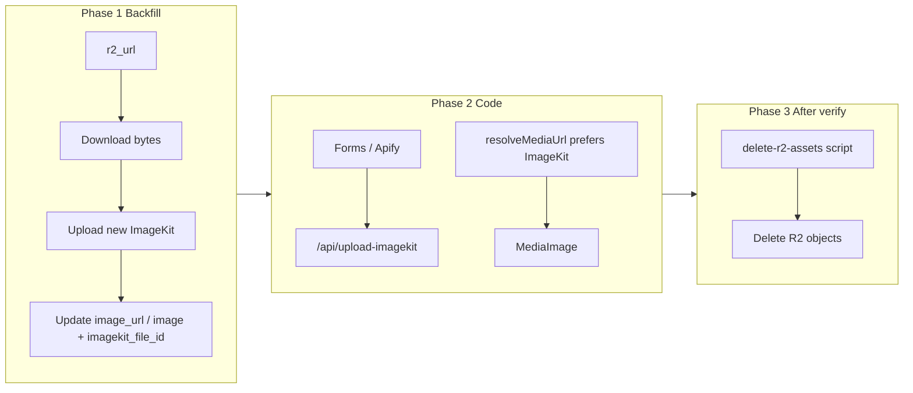

# R2 → ImageKit reverse migration (aesthetic-clinics-my)

Adapted from the completed dental runbook in `dental-clinic-close-to-me-my`. Keep `r2_key` / `r2_url` columns; leave R2 libs until a later cleanup pass.

**Source of truth for scripts to copy:** `/Users/yuyu.salim/Projects/yuyu/dental-clinic-close-to-me-my`

## Project mapping

| | aesthetic (this repo) | dental (reference) |
|--|--|--|
| ImageKit folder root | `aesthetic-clinics-my` | `dental-clinics-my` |
| Clinic folder | `aesthetic-clinics-my/places` | `dental-clinics-my/places` |
| Doctor folder | `aesthetic-clinics-my/persons` | `dental-clinics-my/persons` |
| Area/state folder | `aesthetic-clinics-my/location` | `dental-clinics-my/location` |
| Media CDN (R2) | `https://media.aestheticclinics.my` | `https://media.dentalclinicclosetome.my` |
| R2 bucket | `aesthetic-clinic-media-production` | `dental-clinic-media-production` |
| URL columns (clinic/doctor) | `image_url`, `imagekit_file_id` | same |
| URL columns (areas/states) | `image`, `imagekit_file_id` | same |
| Source for restore | `r2_url` | same |

**Known state (as of copy):**
- Still on R2 for uploads (`uploadFileToR2`)
- `NEXT_PUBLIC_IMAGEKIT_ID` may still be `yuurrific` — update to the **new** ImageKit account before backfill
- `/api/upload-imagekit` and `/api/delete-imagekit` are **missing** — restore/copy from dental before flipping forms
- Hardcoded static URLs still use `ik.imagekit.io/yuurrific/aesthetic-clinics-my/...`

## Safe order (do not reorder)

```text
1. Confirm new ImageKit env in .env.local
2. Add + run backfill R2 → ImageKit (DB write of image_* + imagekit_file_id)
3. Restore app code: ImageKit upload/delete/serve primary
4. Fix hardcoded yuurrific static URLs → NEXT_PUBLIC_IMAGEKIT_ID
5. Smoke-test listings + dashboard uploads
6. Add + run R2 cleanup script (dry-run → execute)
7. Later (optional): remove unused R2 libs/routes/deps
```

Why this order: if ImageKit files were deleted, old `image_url` values are dead. Serving must keep preferring `r2_url` **until** backfill rewrites ImageKit columns; then flip preference to ImageKit.



---

## Phase 0 — Prerequisites (manual)

- [ ] `.env.local` has **new** ImageKit keys: `IMAGEKIT_PRIVATE_KEY`, `NEXT_PUBLIC_IMAGEKIT_ID`, `NEXT_PUBLIC_IMAGEKIT_URL_ENDPOINT`, `NEXT_PUBLIC_IMAGEKIT_PUBLIC_KEY`, `NEXT_PUBLIC_IMAGEKIT_CLINIC_FOLDER_PATH` (`aesthetic-clinics-my/places`)
- [ ] Optional: `NEXT_PUBLIC_IMAGEKIT_FOLDER_ROOT=aesthetic-clinics-my` (for backfill script)
- [ ] R2 env still present (needed for backfill download + later cleanup)
- [ ] Supabase service role available for scripts
- [ ] Static assets already on new ImageKit under the same folder paths
- [ ] Spot-check one static URL with the **new** ID in the browser before coding, e.g.  
  `https://ik.imagekit.io/<NEW_ID>/aesthetic-clinics-my/logos/aesthetic-clinics-my-v3.png`

No schema migration required — ImageKit and R2 columns already exist.

---

## Phase 1 — Backfill script: R2 → ImageKit

Copy from dental and set folder root to `aesthetic-clinics-my`:

| Copy from dental | Notes |
|--|--|
| `tasks/backfill-imagekit-from-r2.ts` | Default `FOLDER_ROOT` → `aesthetic-clinics-my` (or env override) |
| `tasks/delete-r2-assets.ts` | Same as dental (Phase 4) |

**Behavior**
- Tables: `clinic_images`, `clinic_doctor_images`, `areas`, `states`
- Pending: `r2_key IS NOT NULL` and ImageKit URL missing current `NEXT_PUBLIC_IMAGEKIT_ID` (or `imagekit_file_id` null)
- Download `r2_url` → upload ImageKit → update ImageKit columns only
- **Never** clear `r2_key` / `r2_url`
- Flags: dry-run default, `--execute`, `--sample`, `--table=`, `--limit=`, `--batch-size=`, `--delay-ms=`, `--concurrency=`

**Folder mapping (aesthetic)**

| Table | ImageKit folder | DB update |
|-------|-----------------|-----------|
| `clinic_images` | `aesthetic-clinics-my/places` | `image_url`, `imagekit_file_id` |
| `clinic_doctor_images` | `aesthetic-clinics-my/persons` | `image_url`, `imagekit_file_id` |
| `areas` | `aesthetic-clinics-my/location` | `image`, `imagekit_file_id` |
| `states` | `aesthetic-clinics-my/location` | `image`, `imagekit_file_id` |

**npm scripts**
```bash
"backfill-imagekit": "tsx ./tasks/backfill-imagekit-from-r2.ts"
"backfill-imagekit:sample": "tsx ./tasks/backfill-imagekit-from-r2.ts --sample"
"delete-r2-assets": "tsx ./tasks/delete-r2-assets.ts"
```

**Run order**
1. `npm run backfill-imagekit:sample` — verify 20 `clinic_images`
2. `npm run backfill-imagekit -- --execute --concurrency=10` — full run
3. Re-run is safe

---

## Phase 2 — Full code restore (ImageKit primary)

### 2a. Restore missing ImageKit API routes

Copy from dental (aesthetic currently lacks these):

- `app/api/upload-imagekit/route.ts`
- `app/api/delete-imagekit/route.ts`
- `lib/upload-imagekit-client.ts` — change folder defaults to `aesthetic-clinics-my/{places|persons|location}`
- `lib/imagekit-url.ts`

### 2b. Serving preference

Update `lib/media.ts` `resolveMediaUrl` to prefer ImageKit **before** R2:

```ts
fields.image_url || fields.image || fields.thumbnail_image ||
fields.r2_url || fields.original_cloudinary_url || null
```

Update `components/image/media-image.tsx`: relative paths resolve via ImageKit ID, not R2 public URL.

### 2c. Persist / types

- `lib/clinic-images.ts`: `UploadResult = { url, fileId }`; insert `image_url` + `imagekit_file_id`
- Keep `r2_*` optional on types — do not remove

### 2d. Upload callers → ImageKit

Switch from `uploadFileToR2` / `deleteFileFromR2`:

- Clinic: `form-add-clinic.tsx`, `form-edit-clinic.tsx`, `submit-clinic-form.tsx`, row-actions
- Doctor: `form-add-doctor.tsx`, `form-edit-doctor.tsx`, row-actions
- Area/state: `form-edit-area.tsx`, `form-edit-state.tsx`
- Ingestion: `tasks/insert-apify-data.ts` (if present)
- `services/database.service.ts` (if it writes `r2_*`)

Folders: `aesthetic-clinics-my/places|persons|location`. Never hardcode `yuurrific` in fallback URLs.

### 2e. Hardcoded static URLs

Replace `ik.imagekit.io/yuurrific/...` with `imageKitUrl(...)` in at least:

- `components/ui/logo.tsx`
- `emails/layout.tsx`
- `app/(listing)/advertise-with-us/page.tsx`
- `app/(listing)/[state]/page.tsx`
- `app/(listing)/[state]/[area]/page.tsx`
- Grep for any remaining `ik.imagekit.io/yuurrific`

### 2f. Leave for later cleanup

- `lib/r2.ts`, `lib/r2-public.ts`, `lib/upload-r2-client.ts`
- `app/api/upload-r2`, `app/api/delete-r2`
- R2 env + `@aws-sdk/client-s3`
- Dual-column RPCs (harmless)

---

## Phase 3 — Verification checklist

- [ ] Network tab: images load from `ik.imagekit.io/<new-id>/...` with `tr=`
- [ ] No `media.aestheticclinics.my` for DB-backed clinic/doctor/area/state images
- [ ] Doctor avatars load
- [ ] Area/state thumbnails load
- [ ] Logo + placeholders + advertise samples load (new ID)
- [ ] Dashboard upload → ImageKit + `image_url` / `imagekit_file_id`
- [ ] Dashboard delete → `/api/delete-imagekit`
- [ ] Submit-clinic public form upload works

---

## Phase 4 — R2 cleanup (after verify)

Use copied `tasks/delete-r2-assets.ts`:

- Only rows with `r2_key` **and** `imagekit_file_id`
- Delete R2 object; null `r2_key` + `r2_url`
- Dry-run default

```bash
npm run delete-r2-assets
npm run delete-r2-assets -- --execute
```

Do **not** empty the whole bucket blindly.

---

## Quick copy checklist from dental

```bash
# From dental-clinic-close-to-me-my → aesthetic-clinics-my
cp tasks/backfill-imagekit-from-r2.ts ../aesthetic-clinics-my/tasks/
cp tasks/delete-r2-assets.ts ../aesthetic-clinics-my/tasks/
cp lib/upload-imagekit-client.ts ../aesthetic-clinics-my/lib/
cp lib/imagekit-url.ts ../aesthetic-clinics-my/lib/
cp app/api/upload-imagekit/route.ts ../aesthetic-clinics-my/app/api/upload-imagekit/
cp app/api/delete-imagekit/route.ts ../aesthetic-clinics-my/app/api/delete-imagekit/
# Then edit FOLDER_ROOT / folder defaults to aesthetic-clinics-my
```

---

## Out of scope (this pass)

- Dropping `r2_*` DB columns
- Removing R2 libs/API routes/deps
- Cloudflare Image Resizing
- Re-uploading static assets (do manually on new ImageKit first)
